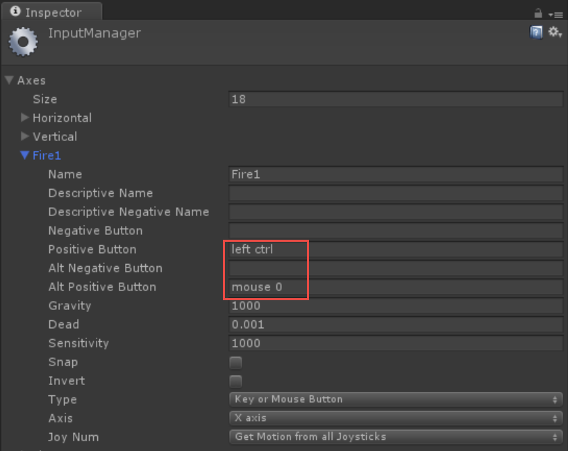

<a name="HOLTop" />
# Introduction to Unity #

----------------

<a name="Overview" />
## Overview ##

Unity is a major player in the cross platform game engine space with over 21 supported platforms, including Windows 10 , MacOS, Linux , Android and iOS. All of which can use the same code base. In this workshop you will builds Orks with Forks (and Knives) - a fun top down 2D game. Keep in mind Unity is not a 3D asset creation system, but instead a system you can arrange your assets, write code to animate, use physics, audio, and more. There are other software packages such as Autodesk Maya or Blender that can be used to 3D model, although Unity does have a built in terrain modelling system. 


<a name="Objectives" />
### Objectives ###

In this module, you will see how to:

- Use Unity's Editor to design a 2D level with sprites
- Handle User Input
- Work with the Camera
- Handle Input from Keyboard


<a name="Prerequisites"></a>
### Prerequisites ###

The following is required to complete this module:

- [Visual Studio Community 2015][1] or greater.
- [Unity 5.3][2] or greater.

[1]: https://www.visualstudio.com/products/visual-studio-community-vs
[2]: unity3d.com

<a name="CodeSnippets" />
### Using the Code Snippets ###

Throughout the module document, you will be instructed to insert code blocks. For your convenience, most of this code is provided as Visual Studio Code Snippets, which you can access from within Visual Studio 2015 to avoid having to add it manually. 

>**Note**: Each exercise is accompanied by a starting solution located in the **Begin** folder of the exercise that allows you to follow each exercise independently of the others. Please be aware that the code snippets that are added during an exercise are missing from these starting solutions and may not work until you have completed the exercise. Inside the source code for an exercise, you will also find an **End** folder containing a complete Unity Project with the code and assets that result from completing the steps in the corresponding exercise. You can use these solutions as guidance if you need additional help as you work through this module. Unity can open multiple instances at a time as well as multiple versions of Unity can exist happily on your system and run at the same time as well.

---

<a name="Exercises" />
## Exercises ##
This module includes the following exercise:

1.  [Getting Started : Creating your first game](#Exercise1)

Estimated time to complete this module: **60 minutes**

>**Note:** When you first start Visual Studio, you must select one of the predefined settings collections. Each predefined collection is designed to match a particular development style and determines window layouts, editor behavior, IntelliSense code snippets, and dialog box options. The procedures in this module describe the actions necessary to accomplish a given task in Visual Studio when using the **General Development Settings** collection. If you choose a different settings collection for your development environment, there may be differences in the steps that you should take into account.

<a name="Getting Started" />
### Getting Started : Creating your first game ###

In this exercise you will create your first Unity game. But first let's explore the Editor interface in Unity.
The Hierarchy window (1) contains everything in your scene. A scene is essentially a level in your game. When the game loads, it will load the first scene in your build settings (control-shift-b) or if you are working in the Editor, the current scene will load when you play test your game.
The Scene tab(2) contains your design surface for your level. Here you drag/drop objects and arrange your objects. Next is the Game window (3) where you will see your game when test playing it. After that is the Inspector window (4) that has the properties of the currently seleccted Game Object. Finally the Project window (5) is what contains all of the art, models, images, scripts, audio, and files (assets) that make up your project.


..
Screenshot of Asset Store
..


<a name="Ex1Task1" />
#### Task 1 - Open Project and Scene ####

To get started we need to open the starter Unity Project and find the scene file. Scenes are your levels in Unity. You will need to find your scene and open it to start working on it, just as you would have to find a web page to work on in a web project. The project may or may not load with it already open, so it is important to understand how to find them.

1. Open Unity
2. Choose "Open Project" 
3. Select the project folder on the desktop "OrksWithForks Starter"
4. Unity will re-open and load the project. 
5. When Unity opens, find the scene file /Assets/Scenes/scene01 and double click it to open it.


<a name="Ex1Task2" />
#### Task 2 - Run the game and modify camera settings ####

Note the Play, Pause, and Frame Advance button on the toolbar. This allows you to play your game without having to manually compile and export a build. Mono is used as the runtime for your scripts (Plus the native engine code) and Unity runs it right in the editor.
When you click play, you'll go into Play Mode. This is a temporary testing mode and most changes you make will be lost so it is important to know when you are in play mode. 

Everything in your game is visible because of a camera. There are two camera types in Unity - Orthographic and Perspective. These are simply options on a camera component. Perspective cameras see the world as we do, Orthographic cameras have no scaling with distance, which is good for 2D games. Also Othergraphic camera size keeps a fixed height no matter the screen we are running the game on. The only thing that varies is how much width is visible.


_Orthographic Camera, Note the height


_Orthographic Camera, Note the height is still the same with a thinner screen_


1. Click play on the toolbar and run the game.


2. Move across the screen to the exit. Note the camera doesn't follow.
3. When you are done make sure you click play again to get out of play mode.
4. In the project window at the bottom, Navigate to /Scripts/
5. Drag and drop the CameraFollow.cs script onto the Camera Game Object in the hierarchy.  
6. Click play again and notice how the camera now follows the character.
7. Get out of play mode.
8. ** Verify you are not in play mode ** Press Control-S to save your scene. If you are in play mode you'll get an error.
9. In the hierarchy window, select the Camera game object.


10. In the Inspector window, change the size on the orthographic camera component to customize how much vertical height the user will see no matter the device they run it on.


<a name="Ex1Task3" />
#### Task 3 - Organize the Hierarchy Window ####

The hierarchy window is a bit messy. It lists all of the game objects in the current scene. A game object is a container for other objects and also components which bring your game objecs to life. Let's organize this window a bit more. 

1. Select the menu GameObject / Create Empty
2. Rename this new game object to "Enemies"
    Ensure you press Enter when done (don't just click away)
3. In the Hierarchy window only, drag and drop the Orks and Goblin onto this new game object.

4. Select the menu GameObject / Create Empty
5. In the Hierarchy window only, drag and drop all the 'walls' onto the "Environment" game object to clean up the view
    You can control-click or click one and shift click another item, jsut as you would in Windows Explorer to select files. 
6. Collapse the Environment and Enemies game objects to clean up the hierarchy view 
   
    

<a name="Ex1Task4" />
#### Task 4 - Add Level Pieces  ####

Prefabs are a concept in Unity of a 'prefabricated object'. These are game object settings, components like physics and scripts. Our walls need to have physics on them. 

The level is incomplete. The left edge has been removed. Add some level pieces from the /Prefabs folder

1. Use the /Sprites/Floors folder to drag/drop sprites into the Scene tab to draw out a floor plan.
    This folder is being used because we can simply run across an image. The case we need ot handle is how we stop at a wall
2. Use the /Prefabs folder to drag/drop walls into the scene and draw the level.
    The walls are ordered by top/bottom after each center piece. Because of the top down scaling perspective view, the walls on each side of the center pieces have bricks directed in opposite directions. Enemies will move until they hit any object with a collider on it.
3. Now the tricky part. Vertex snapping. In order to get everything in place all night and neat we need to snap one vertex to the next closest vertex. Hold down V and mouse near the edge of a piece you want to snap to another.

    
    
<a name="Ex1Task5" />
#### Task 5 - Allow the player to play the attack and walk animations ####

An animation has already been setup to allow the player to attack. This needs to be triggered when you click the mouse. WE read this input setting via Unity's Input Manager. Those settings are found under the menu Edit/Project Settings/Input. This shows the input for Fire1 to be left control or the first mouse button (mouse 0 - ie left click)




1. In the /Scripts/PlayerController.cs file, find the empty Update() method. add the following code to it. This will run every frame and check for Fire1. It will only be true once and that's during the frame that runs and finds it held down. If the button is held down, this will not repeat, although that is possibe to do with GetButton() 
```csharp
    void Update()
    {
        if (Input.GetButtonDown("Fire1"))
        {
            _animator.SetTrigger("Attack");
        }
    }
```

2. Also in the Update() function, set the boolean variable for walking under the //TODO section by adding the following code. This will tell the animation system to transition to the Walk animation.
```csharp
        _animator.SetBool("Walk", _horizontal != 0);
```

3. Save your code and go back to Unity. There will be a few second pause while your code is _automatically_ compiled by Unity.
4. Click Play to test out the changes. You should now get a walking animation when you move and an attack animation when you press the left mouse button or left control key.

<a name="Ex1Task19" />
#### Task 19 - Enemy ####

<a name="Ex1Task20" />
#### Task 20 - Enemy Group ####

<a name="Ex1Task21" />
#### Task 21 - The Explosive Finale ####

<a name="Summary" />
## Summary ##

